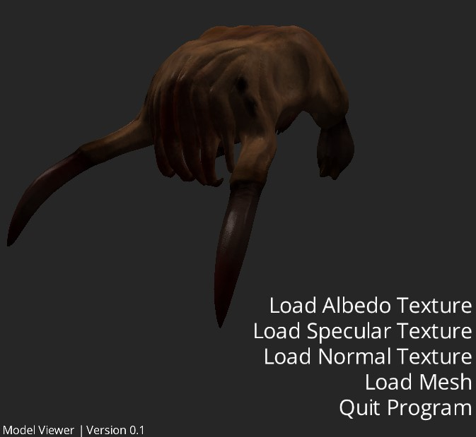

# Model Viewer CPP

Program written in CPP for loading + viewing .obj 3D models.

Nearly all of the code is original with the exception of
- [stb](https://github.com/nothings/stb)
  - rect_pack
  - truetype
  - image
- [tinyobjloader](https://github.com/tinyobjloader/tinyobjloader)
- [glad](https://github.com/Dav1dde/glad)

This project is written such that when I learn other rendering APIs I can come back to it and implement those APIs

## Limitations
- Only one mesh is loaded from OBJ

## Screenshots

## Camera Controls
| Key                 | Action                    |
|---------------------|---------------------------|
| W/A/S/D             | Pan Up/Left/Down/Right    |
| Right Click + Mouse | Rotate Camera             |
| Scroll Wheel        | Zoom In/Out               |
| Ctrl + M            | Quick Load Mesh           |
| Ctrl + A            | Quick Load Albedo Texture |
| Ctrl + G            | Quick Load Spec   Texture |
| Ctrl + N            | Quick Load Normal Texture |

## Download and Installation

[Latest release (version 0.1)](releases/ModelViewer_ver0_1.zip)

Unzip and run `ModelViewer.exe`.

The program will not run without the resources folder present in the same directory

Suzanne model by the [Blender Foundation](https://www.blender.org/)

## Table of Contents
- [Screenshots](screenshots)
- [Releases](releases)
